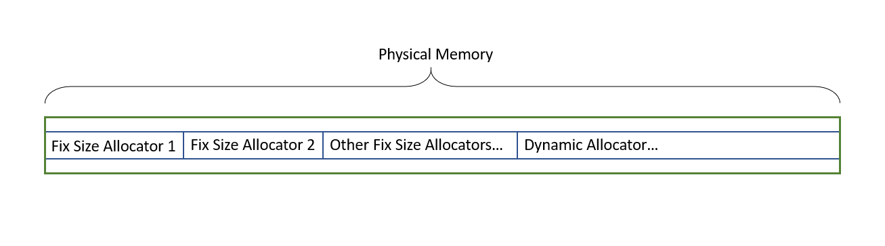
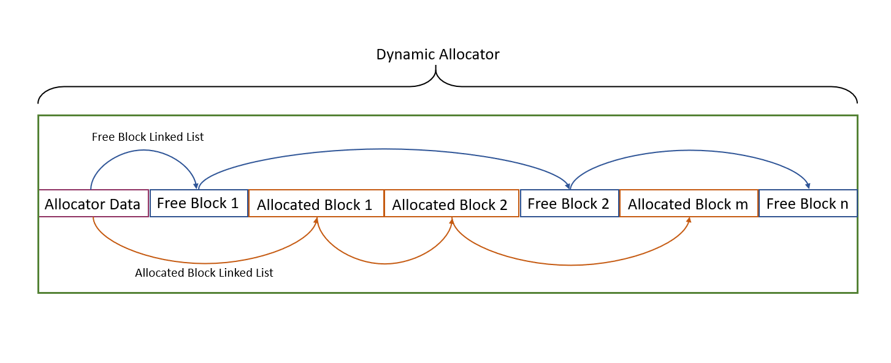
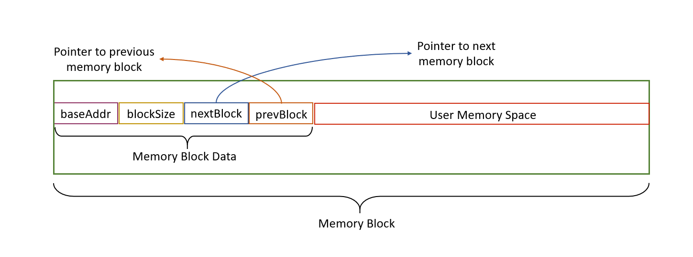
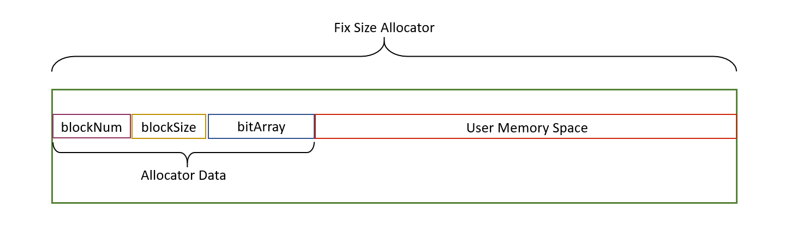

# Memory Allocator

## Introduction
MemoryAllocator is a hardware-oriented memory allocator. That is, given the starting address and the size of physical memory space, MemoryAllocator manages memory allocations on this memory space without using extra memory space and external APIs. MemoryAllocator acts like the `malloc()` and `free()` functions in C language and the `new` and `delete` operators in C++ language.


## Features
+ MemoryAllocator does not rely on *C++ Standard Library (STD)* and has minimal dependency on *C Runtime Library (CRT)* that is necessary for its regular operation (e.g., `assert.h`, `inttypes.h`, `stdlib.h`, etc.) Advanced data structures and logic are implemented using basic C/C++ syntax instead of external libraries.
+ MemoryAllocator is compatible with both 32-bit system and 64-bit system. It is also compatible with most operating systems. MemoryAllocator can be easily deployed on different systems like Windows, Linux, macOS, etc.
+ MemoryAllocator is made up of several independent sub-systems: one dynamic allocator and several fix size allocators (See below for more detail of dynamic allocator and fix size allocator). By doing so, the coupling of each sub-system is highly reduced, which also reduces the risk of overall crashes caused by errors from one of the sub-systems. In this project, MemoryAllocator has one dynamic allocator, one 16-bit fix size allocator, one 32-bit fix size allocator and one 96-bit fix size allocator.
+ The structure of MemoryAllocator is like: 
  

## APIs
The APIs of MemoryAllocator includes:
  ```cpp
    bool InitializeMemoryAllocator(void * i_pHeapMemory, size_t i_sizeHeapMemory);

    void DestroyMemoryAllocator();

    void* Alloc(size_t size);

    void Free(void* ptr);

    void Collect();

    void* operator new(size_t size);

    void* operator new[](size_t size);

    void operator delete(void* ptr);

    void operator delete[](void* ptr);
  ```


## Dynamic Allocator
+ ### Features
    DyanmicAllocator is a memory allocator designed for general memory allocation. DynamicAllocator uses two linked lists to manage its memory space. One linked list is for managing free memory blocks in the allocator, and the other is for managing allocated memory blocks. Note that after the instantiation of DynamicAllocator, its initial memory space will be treated as its first free memory block.

    However, using linked lists to manage memory space has two areas for improvement. Firstly, linked list nodes require extra memory space to store data like the pointer of its next/previous node, the size of the memory block, etc. If the memory size that the user requests is small, the memory overhead of creating a linked list node will be relatively high. Secondly, DynamicAllocator always looks for the first free memory block that can satisfy user's demand instead of the best-fit free memory block. This will leads to serious memory fragmentation problems.

    A solution to the first shortcoming is fix size allocator, which is specially designed for small-size allocation (see below). As for the second shortcoming, DynaimcAllocator provides a `Collect()` function to merge memory fragmentations into a large memory block. To do that, DynamicAllocator needs to sort the order of the free block list each time when releasing a memory block.

    The structure of DynamicAllocator is like: 

    The structure of each memory block in DynamicAllocator is like: 


+ ### APIs
    The APIs of DynamicAllocator includes:
  ```cpp
    void* Alloc(size_t size);

    void* Alloc(size_t size, unsigned int alignment);

    bool Free(void* ptr);

    bool Contains(void* ptr);
    
    bool IsAllocated(void* ptr);

    void Collect();

    void Destroy();

    DynamicAllocator* CreateDynamicAllocator(void* baseAddr, size_t size);
  ```


## Fix Size Allocator
+ ### Features
    FixSizeAllocator is a memory allocator designed for small-size memory allocation. Fix size allocation is an optimized solution for the memory overhead problem of DynamicAllocator. The number and size of memory blocks in FixSizeAllocator are defined by users and are fixed during runtime. 

    Instead of using linked lists to manage memory space, FixSizeAllocator takes advantage of bit array. Bit array is an array that monitors the status of each memory block in FixSizeAllocator. Bit array's elements are 32-bit or 64-bit unsigned integers, based on the current system's architecture. Each bit in each element monitors a memory block in FixSizeAllocator. A clear bit (0) represents an allocated block, and a set bit (1) represents a free block. Compared with the linked list approach in DynamicAllocator, the memory overhead produced by bit array is negligible. What's more, FixSizeAllocator can access any memory block by adding an offset to the base address of the first memory address, which is way faster than iterating the linked list to find the expected memory block.

    The structure of FixSizeAllocator is like: 

+ ### APIs
    The APIs of FixSizeAllocator includes:
  ```cpp
    void* Alloc();

    bool Free(void* ptr);

    bool Contains(void* ptr);

    bool IsAllocated(void* ptr);

    void Destroy();

    FixSizeAllocator* CreateFixSizeAllocator(void* baseAddr, size_t blockNum, size_t blockSize, size_t heapSize);
  ```